# GR00T Flow Map

이 문서는 GR00T 관련 코드가 파일 사이에서 어떻게 이어지는지 읽기 위한 입문용 지도다.
실행 runbook이 아니라, 어떤 entry point에서 어떤 파일과 함수를 거쳐 어떤 값이 전달되는지
따라가기 위한 문서다.

범위:

- GR00T N1.6 native Isaac-GR00T 경로
- GR00T N1.5 native Isaac-GR00T 경로
- LeRobot `GrootPolicy`로 감싼 GR00T N1.5 경로
- RoboCasa365 checkpoint/profile
- ZMQ, HTTP `/act`, HTTP `/act_with_features`
- SAFE feature collection의 action/feature 저장 경계

용어: 이전 논의에서 `naive`라고 부른 경로는 이 문서에서 `native`로 표기한다. 즉 LeRobot
wrapper를 거치지 않고 Isaac-GR00T 서버/정책을 직접 쓰는 경로다.

처음 읽을 때는 이 문서로 전체 지도를 잡고, 실제 실행은 각 runbook으로 이동한다.

## First Rule: N1.5 And N1.6 Are Asymmetric

`scripts/safe/groot_n15/robocasa/`는 `src/policies/groot/`의 N1.5판이 아니다.
여기에는 loader, schema, RoboCasa IO adapter, serving service, SAFE feature extractor 같은
backend library 역할이 없다.

| 역할 | N1.6 위치 | N1.5 위치 또는 상태 |
|---|---|---|
| 모델 class / loader | `src/policies/groot/core/loader.py`, upstream Isaac-GR00T N1.6 | submodule native `gr00t.*` 또는 LeRobot port `lerobot.policies.groot.*`; repo-local backend library 없음 |
| HTTP serving service | `scripts/serve/groot.py` + `src/policies/groot/core/service.py` | `scripts/serve/lerobot.py` + `scripts/serve/lerobot_adapters/groot.py` |
| RoboCasa IO / schema mapping | `src/policies/groot/core/schema.py`, `src/policies/groot/robocasa/io.py` | N1.5 LeRobot HTTP eval은 shared RoboCasa IO를 obs->unified request 경계에서 재사용한 뒤 LeRobot camera 이름만 변환한다. LeRobot serving adapter는 `scripts/serve/lerobot_adapters/groot.py`; native ZMQ eval은 client-local alias/filter |
| Native ZMQ serving | N1.6 upstream server 또는 SAFE `feature_server.py` | external `src/policies/Isaac-GR00T-N1.5/scripts/inference_service.py`; `groot_n15` script는 client |
| SAFE DiT/VL feature capture | `src/policies/groot/safe/features.py`, `scripts/safe/groot_n16/.../serve/feature_server.py` | N1.5 전용 feature extractor backend는 없음. `collect/http_feature_collect.py`는 LeRobot HTTP `/act_with_features` 응답을 N1.6 SAFE triplet schema로 저장하는 client |
| Eval / split / checkpoint helper | `scripts/eval/*`, `scripts/safe/groot_n16/*` | `scripts/safe/groot_n15/robocasa/{eval,collect,split,utils}` |

이 비대칭성이 폴더 구조가 섞여 보였던 가장 큰 이유다. 현재 정리 기준은 두 겹이다.
N1.6 backend library는 `src/policies/groot/`에 응집한다. N1.5는 그런 backend library를
새로 만들지 않고, repo-local RoboCasa script bundle만 `scripts/safe/groot_n15/` 아래에
응집한다. 따라서 "GR00T 역할 코드"를 찾을 때 N1.6은 `src/policies/groot/`부터 보지만,
N1.5는 먼저 `scripts/safe/groot_n15/README.md`에서 native ZMQ, LeRobot HTTP, feature
collection, split/helper entrypoint를 나눠 본다.

| 읽고 싶은 것 | 다음 문서 |
|---|---|
| N1.6 native 학습/평가 명령 | [n16_01_finetune.md](n16_01_finetune.md), [n16_02_eval.md](n16_02_eval.md) |
| N1.6 SAFE 수집 | [n16_03_safe_overview.md](n16_03_safe_overview.md), [n16_04_safe_collection.md](n16_04_safe_collection.md) |
| N1.6 HTTP 변경/검증 | [n16_09_safe_parity.md](n16_09_safe_parity.md), [n16_11_http_act_changes.md](n16_11_http_act_changes.md) |
| N1.6 구조 리팩토링 결과 | [n16_12_robocasa_refactor_report.md](n16_12_robocasa_refactor_report.md) |
| N1.5 native 평가 | [n15_02_eval.md](n15_02_eval.md), [n15_07_native_zmq_openfridge.md](n15_07_native_zmq_openfridge.md) |
| N1.5 LeRobot HTTP | [n15_03_lerobot_robocasa365.md](n15_03_lerobot_robocasa365.md), [n15_04_lerobot_serve_adapter.md](n15_04_lerobot_serve_adapter.md), [n15_05_lerobot_obs_bridge.md](n15_05_lerobot_obs_bridge.md), `scripts/safe/groot_n15/robocasa/collect/http_feature_collect.py` |

## One-Screen Map

크게 보면 세 층이다.

```text
checkpoint profile
  -> server/model loader
  -> eval or collector client
  -> observation adapter
  -> policy inference
  -> action adapter
  -> RoboCasa env.step or SAFE artifact writer
```

GR00T 관련 파일은 이 층 중 하나에 속한다.

| 층 | 대표 파일 | 하는 일 |
|---|---|---|
| Profile | `configs/checkpoints/groot__robocasa365_ckpt120000.yaml` | N1.6 native GR00T profile. checkpoint path, `embodiment_tag`, image/state/action contract |
| Profile | `configs/checkpoints/lerobot_groot_n15__robocasa365_ckpt120000.yaml` | N1.5 LeRobot wrapper profile. HF repo/subfolder, `policy_type: groot`, crop/resize/action layout |
| Native GR00T HTTP server | `scripts/serve/groot.py` | `base_model: groot` profile을 FastAPI `/act`, `/act_with_features`로 serve |
| LeRobot HTTP server | `scripts/serve/lerobot.py` | `base_model: lerobot` profile을 FastAPI `/act`, `/act_with_features`로 serve |
| LeRobot adapter registry | `scripts/serve/lerobot_adapters/factory.py` | `model_specific.policy_type`으로 `PiPolicyAdapter` 또는 `GrootPolicyAdapter` 선택 |
| LeRobot GR00T adapter | `scripts/serve/lerobot_adapters/groot.py` | raw Isaac-GR00T N1.5 checkpoint를 LeRobot `GrootPolicy`로 로드 |
| GR00T shared schema | `src/policies/groot/core/schema.py` | unified HTTP key와 GR00T native key의 이름 대응 |
| GR00T RoboCasa IO | `src/policies/groot/robocasa/io.py` | RoboCasa native obs/action을 HTTP/ZMQ 양쪽에서 공유하는 adapter |
| GR00T HTTP runtime | `src/policies/groot/core/service.py` | HTTP payload를 GR00T observation으로 만들고 action/features를 응답으로 변환 |
| Native rollout wrapper | `src/policies/groot/robocasa/env_wrappers.py` | upstream `VideoRecordingWrapper`/`MultiStepWrapper` 적용, 3-view video 유지 |
| Project HTTP eval | `scripts/eval/robocasa_eval.py` | RoboCasa env에서 `VLAClient`로 HTTP 서버 호출 |
| N1.6 ZMQ eval | `scripts/eval/groot_robocasa_zmq_eval.py` | upstream rollout helper와 N1.6 `PolicyClient` 연결 |
| N1.5 script bundle | `scripts/safe/groot_n15/README.md`, `scripts/safe/groot_n15/robocasa/run_config.{py,sh}` | N1.5 repo-local script entrypoint와 shared path/run identity |
| N1.5 ZMQ eval client | `scripts/safe/groot_n15/robocasa/eval/native_zmq_eval.py` | external N1.5 `inference_service.py` ZMQ protocol에 말 거는 client |
| N1.5 LeRobot HTTP eval | `scripts/safe/groot_n15/robocasa/eval/lerobot_http_eval.py` | official RoboCasa env에서 LeRobot HTTP server 호출. RoboCasa obs alias/state/language extraction은 `src/policies/groot/robocasa/io.py`를 재사용 |
| N1.5 LeRobot HTTP feature collector | `scripts/safe/groot_n15/robocasa/collect/http_feature_collect.py` | official RoboCasa env에서 `/act_with_features` 호출 후 N1.6 SAFE-style `pkl/csv/mp4` triplet 저장 |
| SAFE N1.6 feature server | `scripts/safe/groot_n16/robocasa/serve/feature_server.py` | ZMQ `get_action_with_features`로 action과 hidden state 반환 |
| SAFE N1.6 collector | `scripts/safe/groot_n16/robocasa/collect/collect_rollout.py` | episode 실행, action/feature/video/csv/pkl 저장 |

## Inference-Time N1.5/N1.6 Merge/Split Map

N1.5 LeRobot HTTP와 N1.6 native HTTP는 밖에서 보면 같은 project HTTP API를 쓴다.
공유되는 구간은 evaluator/client/API envelope이고, model runtime과 obs/action 변환은
서버 안에서 갈라진다.

```mermaid
flowchart LR
    classDef shared fill:#e8f5e9,stroke:#2e7d32,stroke-width:2px,color:#15351d;
    classDef n15 fill:#fff8e1,stroke:#f9a825,stroke-width:2px,color:#3b2b00;
    classDef n16 fill:#e3f2fd,stroke:#1565c0,stroke-width:2px,color:#0d2538;
    classDef out fill:#f3e5f5,stroke:#7b1fa2,stroke-width:2px,color:#331042;

    Env["RoboCasa / evaluator"]:::shared
    Client["VLAClient<br/>scripts/utils/vla_client.py"]:::shared
    API["Shared HTTP API<br/>/act, /act_with_features, /reset, /health"]:::shared
    Out["Shared response shape<br/>action.* sub-keys"]:::out

    Env --> Client --> API

    API --> N15Serve["N1.5 LeRobot HTTP<br/>scripts/serve/lerobot.py"]:::n15
    N15Serve --> N15Adapter["GrootPolicyAdapter<br/>scripts/serve/lerobot_adapters/groot.py"]:::n15
    N15Adapter --> N15Runtime["N1.5 compatibility glue<br/>scripts/safe/groot_n15/robocasa/utils/runtime.py"]:::n15
    N15Runtime --> N15Model["LeRobot GrootPolicy<br/>/act: select_action(batch)<br/>/act_with_features: predict_action_chunk(batch)"]:::n15
    N15Model --> N15Post["LeRobot postprocessor<br/>native action unapply"]:::n15
    N15Post --> Out

    API --> N16Serve["N1.6 native HTTP<br/>scripts/serve/groot.py"]:::n16
    N16Serve --> N16Service["GrootPolicyService<br/>src/policies/groot/core/service.py"]:::n16
    N16Service --> N16Loader["load_groot_policy<br/>src/policies/groot/core/loader.py"]:::n16
    N16Loader --> N16Model["Isaac-GR00T N1.6<br/>Gr00tSimPolicyWrapper.get_action(obs)"]:::n16
    N16Model --> N16Post["native action dict<br/>convert_native_action_to_subkeys"]:::n16
    N16Post --> Out
```



| 구간 | 공유 여부 | 설명 |
|---|---|---|
| Eval client / HTTP payload | 공유 | `VLAClient`가 `observation.images.*`, `observation.state.*`, `task`를 같은 `/act` payload로 보낸다. |
| HTTP endpoint shape | 공유 | N1.5 LeRobot server와 N1.6 native server 모두 `/act`, `/act_with_features`, `/reset`, `/health` 모양을 유지한다. |
| Profile/action response contract | 공유 | 두 경로 모두 profile의 `action_layout` / `emits_subkeys`를 기준으로 `action.*` sub-key 응답을 만든다. |
| Image/state preprocessing | 분리 | N1.5는 LeRobot feature spec, 224 crop/resize, rotation6d state packing을 쓴다. N1.6은 GR00T native 256 image와 modality key mapping을 쓴다. |
| Model load / forward | 분리 | N1.5는 LeRobot `GrootPolicy`를 쓰되 `/act`는 `select_action`, `/act_with_features` feature collection은 `predict_action_chunk`로 chunk를 보존한다. N1.6은 Isaac-GR00T `Gr00tSimPolicyWrapper.get_action`. |
| Runtime compatibility | 분리 | N1.5는 repo-local runtime patch가 필요하고, N1.6은 `src/policies/groot/core/loader.py`의 native loader path를 쓴다. |
| SAFE feature capture | 비대칭 | N1.6은 `src/policies/groot/safe/features.py`를 HTTP/ZMQ에서 공유한다. N1.5는 LeRobot HTTP `/act_with_features`로 나온 `features.hidden_states`를 수집 client가 저장하지만, N1.6 같은 repo-local feature extractor backend는 없다. |

Native ZMQ 경로는 이 HTTP merge 지점을 지나지 않는다. N1.5 native ZMQ는
`src/policies/Isaac-GR00T-N1.5/scripts/inference_service.py`, N1.6 native/Safe ZMQ는
`run_gr00t_server.py` 또는 `scripts/safe/groot_n16/robocasa/serve/feature_server.py`를
직접 호출한다.

## Current Folder Axes

현재 폴더 구조는 "모델 버전", "transport", "실험/수집 script", "재사용 가능한 library code"
축으로 정리한다. 특히 N1.5는 backend library 대칭을 만들지 않고, repo-local script bundle만
`scripts/safe/groot_n15/` 아래에 응집한다.

| 위치 | 맡는 책임 | 새 코드를 둘 때의 기준 |
|---|---|---|
| `scripts/serve/` | HTTP server entry point와 server-wide envelope | FastAPI route, `/act`/`/act_with_features` response shape, policy adapter dispatch |
| `scripts/serve/lerobot_adapters/` | LeRobot policy별 load/forward 차이 | LeRobot `PiPolicy`, `GrootPolicy`처럼 policy type에 묶인 차이 |
| `src/policies/groot/` | N1.6 native GR00T reusable runtime/library | HTTP/ZMQ 양쪽에서 재사용할 schema, loader, RoboCasa IO, SAFE feature extractor |
| `scripts/safe/groot_n15/` | N1.5 script bundle entrypoint | N1.5 repo-local scripts의 role map. `robocasa/run_config.{py,sh}`가 shared path/run identity를 제공 |
| `scripts/safe/groot_n15/robocasa/` | N1.5 RoboCasa eval/feature-collect/split/checkpoint helper | eval client, `/act_with_features` 수집 client, split 준비, base checkpoint helper, LeRobot runtime patch만 둔다. loader/schema/IO/serve/feature extractor library를 두지 않는다. |
| `scripts/safe/groot_n16/robocasa/` | N1.6 SAFE 수집/eval/visualization scripts | SAFE artifact writer, ZMQ feature server, offline visualization runner |
| `scripts/safe/_common/` | SAFE script 공통 helper | N1.5/N1.6 split symlink, rollout filename parsing/formatting처럼 script tree 안에서만 공유하는 helper |
| `src/policies/safe_metadata.py` | SAFE feature metadata naming and alias normalization | policy/version을 가로지르는 `feature_kind`, `feature_axes`, horizon metadata |
| `scripts/utils/` | project-level script utility | `VLAClient`, checkpoint profile처럼 특정 GR00T version에 묶이지 않는 script utility |
| `src/utils/common/` | cross-server/client primitives | image decode, serving health/reset, feature blob처럼 GR00T version에 묶이지 않는 공통 규약 |

따라서 `scripts/safe/groot_n15/robocasa/utils/runtime.py`가 serve adapter에서 import되는 것은
지금 기준으로는 의도된 예외다. N1.5 LeRobot 호환 patch가 parity/eval과 HTTP serve 둘 다에
필요하지만, 그 동작은 N1.5 RoboCasa checkpoint에 강하게 묶여 있다. 이 파일을 옮기려면
`scripts/serve/lerobot_adapters/groot.py`와 N1.5 layout test를 같이 바꾸는 별도 migration으로
다루는 편이 안전하다.

N1.5 LeRobot HTTP eval이 `src/policies/groot/robocasa/io.py`를 import하는 것도 같은 원칙의
예외다. `scripts/safe/groot_n15/robocasa/`가 reusable IO library를 소유하지 않고,
이미 존재하는 RoboCasa native obs alias/state/language adapter를 읽어 쓰는 얇은 client로 남긴다.

## Two Data Languages

헷갈림의 대부분은 "같은 카메라와 action인데 이름이 다름"에서 나온다.

### Unified HTTP Language

Project HTTP server/client가 쓰는 공통 이름이다.

```text
observation.images.left
observation.images.right
observation.images.wrist
observation.state.eef_pos_rel
observation.state.eef_quat_rel
observation.state.gripper_qpos
observation.state.base_position
observation.state.base_rotation
task

action.eef_pos
action.eef_axisangle
action.gripper
action.base_motion
action.control_mode
```

`scripts/utils/vla_client.py`는 image dict를 base64 PNG로 바꾸고, state dict와 `task`를
JSON payload에 넣어 `/act` 또는 `/act_with_features`로 보낸다.

### GR00T Native RoboCasa Language

`GrootRoboCasaEnv`와 Isaac-GR00T policy가 보는 이름이다.

```text
video.res256_image_side_0
video.res256_image_side_1
video.res256_image_wrist_0
video.robot0_agentview_left
video.robot0_agentview_right
video.robot0_eye_in_hand
state.end_effector_position_relative
state.end_effector_rotation_relative
state.gripper_qpos
state.base_position
state.base_rotation
annotation.human.action.task_description
annotation.human.task_description

action.end_effector_position
action.end_effector_rotation
action.gripper_close
action.base_motion
action.control_mode
```

이 둘의 대응표는 `src/policies/groot/core/schema.py`가 단일 출처다.
`src/policies/groot/robocasa/io.py`는 이 표를 사용해 HTTP/ZMQ 경로의 observation과 action을
실제로 변환한다.

## Profiles

Profile YAML은 "어떤 서버가 어떤 checkpoint를 어떤 입출력 계약으로 띄울지" 정한다.

### N1.6 Native Profile

`configs/checkpoints/groot__robocasa365_ckpt120000.yaml`

핵심 필드:

```yaml
base_model: groot
checkpoint_source:
  type: local
  id: /temporal_vla/outputs/checkpoints/grootn16_robocasa365_multitask_learning/checkpoint-120000
n_action_steps: 16
observation_requirements:
  images: [side_0, side_1, wrist_0]
  state: [eef_pos_rel, eef_quat_rel, gripper_qpos, base_position, base_rotation]
emits_subkeys:
  - action.eef_pos
  - action.eef_axisangle
  - action.gripper
  - action.base_motion
  - action.control_mode
model_specific:
  embodiment_tag: NEW_EMBODIMENT
```

이 profile은 `scripts/serve/groot.py`와 N1.6 SAFE ZMQ feature server에서 사용한다.
`embodiment_tag`는 checkpoint metadata branch 선택에 직접 영향을 주므로 RoboCasa365
checkpoint에서는 특히 중요하다.

### N1.5 LeRobot Profile

`configs/checkpoints/lerobot_groot_n15__robocasa365_ckpt120000.yaml`

핵심 필드:

```yaml
base_model: lerobot
checkpoint_source:
  type: hf_repo
  id: robocasa/robocasa365_checkpoints
n_action_steps: 16
image_preprocess:
  resolution: 224
  center_crop: true
  center_crop_scale: 0.95
model_specific:
  policy_type: groot
  checkpoint_subfolder: gr00t_n1-5/multitask_learning/checkpoint-120000
  embodiment_tag: new_embodiment
  raw_language: true
  native_action_unapply: true
  load_native_eagle_projector: true
```

이 profile은 `scripts/serve/lerobot.py`에서 읽고, `policy_type: groot` 때문에
`scripts/serve/lerobot_adapters/groot.py::GrootPolicyAdapter`가 선택된다.
주의할 점은 checkpoint가 LeRobot `Policy.save_pretrained()` 산출물이 아니라 raw Isaac-GR00T
학습 산출물이라는 것이다. 그래서 adapter가 HF subfolder snapshot, metadata stats, Eagle
projector, action postprocessor를 맞춘다.

## Flow A: N1.6 Native HTTP `/act`

이 경로는 native Isaac-GR00T N1.6 checkpoint를 project FastAPI contract 뒤에 둔다.
주로 endpoint smoke, HTTP parity, project evaluator 연결에 사용한다.

```text
scripts/serve/groot.py --profile configs/checkpoints/groot__robocasa365_ckpt120000.yaml
  -> load_profile()
  -> GrootPolicyService.profile = profile
  -> uvicorn FastAPI app

FastAPI startup
  -> GrootPolicyService.load_policy()
  -> src/policies/groot/core/loader.py::load_groot_policy()
  -> Gr00tPolicy(embodiment_tag=NEW_EMBODIMENT, model_path=..., strict=True)
  -> Gr00tSimPolicyWrapper
```

HTTP request가 들어오면:

```text
VLAClient.predict(images, states, instruction, inference_seed)
  -> scripts/utils/vla_client.py::_build_payload()
     images["left"]  -> observation.images.left = base64_png
     images["right"] -> observation.images.right = base64_png
     images["wrist"] -> observation.images.wrist = base64_png
     states[...]     -> observation.state.*
     instruction     -> task
     inference_seed  -> optional call-local seed
  -> POST /act

scripts/serve/groot.py /act
  -> GrootPolicyService.act(payload)
  -> build_groot_obs(payload)
     observation.images.* -> video.* according to loaded modality_keys
     observation.state.*  -> state.*
     task                 -> language keys
  -> temporary_inference_seed(payload["inference_seed"])
  -> self.policy.get_action(groot_obs)
  -> convert_native_action_to_subkeys()
     action.end_effector_position -> action.eef_pos
     action.end_effector_rotation -> action.eef_axisangle
     action.gripper_close         -> action.gripper
  -> JSON response
```

값의 shape는 보통 아래처럼 읽는다.

| 값 | 위치 | 의미 |
|---|---|---|
| `observation.images.left/right/wrist` | HTTP payload | base64 PNG, one frame |
| `video.*` | GR00T observation | `[1, 1, H, W, 3]` |
| `state.*` | GR00T observation | `[1, 1, D]` |
| `action.eef_pos` | HTTP response | `[H, 3]`, H는 action horizon |
| `action.eef_axisangle` | HTTP response | `[H, 3]` |
| `action.gripper` | HTTP response | `[H, 1]` |
| `action.base_motion`, `action.control_mode` | HTTP response | profile이 emit하도록 보장. checkpoint가 안 내면 zero fallback |

## Flow B: N1.6 Native HTTP Closed-Loop Eval

`scripts/eval/robocasa_eval.py --use-groot-env`는 RoboCasa env를 돌리면서 HTTP server에
action을 묻는다.

```text
scripts/eval/robocasa_eval.py --use-groot-env --vla-server http://localhost:8500
  -> VLAClient(url=:8500)
  -> make_groot_robocasa_processors(strict=True, action_mode="step")
  -> create_eval_env(..., use_groot_env=True)
  -> env.reset(seed=...)

per step:
  GrootRoboCasaEnv observation
  -> GrootRoboCasaObsProcessor.process_observation()
  -> groot.robocasa.io.prepare_groot_robocasa_http_request()
     video.res256_image_side_0 / robot0_agentview_left -> observation.images.left
     state.end_effector_position_relative              -> observation.state.eef_pos_rel
     annotation.human.*                                -> task
  -> VLAClient.predict(... /act ...)
  -> GrootRoboCasaActionProcessor(mode="step")
  -> groot.robocasa.io.convert_http_actions_to_groot_step()
  -> env.step({"action.end_effector_position": [3], ...})
```

`mode="step"`은 HTTP response의 action chunk 중 첫 step만 env에 실행한다. Closed-loop에서는
다음 sim observation을 보고 다시 `/act`를 호출하기 때문이다.

## Flow C: N1.6 Native ZMQ Eval

이 경로는 upstream GR00T evaluation에 가장 가깝다. HTTP JSON을 거치지 않고,
GR00T `PolicyClient`가 ZMQ로 native observation을 보낸다.

서버 쪽은 runbook에서 `run_gr00t_server.py`를 띄운다.

```text
src/policies/Isaac-GR00T/gr00t/eval/run_gr00t_server.py
  -> Gr00tPolicy / Gr00tSimPolicyWrapper
  -> PolicyServer endpoint get_action
```

클라이언트 쪽:

```text
scripts/eval/groot_robocasa_zmq_eval.py
  -> AliasedPolicyClient(host, port)
  -> rollout_policy.run_rollout_gymnasium_policy()
  -> create_three_view_eval_env()
     rollout_policy.get_gym_env()
     robocasa_env_wrappers.wrap_groot_robocasa_eval_env()
       CanonicalRoboCasaVideoObservationFilter
       VideoRecordingWrapper
       MultiStepWrapper

per policy call:
  GrootRoboCasaEnv observation
  -> groot.robocasa.io.prepare_groot_robocasa_observation(strict=True)
     fills res256 <-> robot0 camera aliases
     fills old/new language aliases
     filters required video/state/language keys
  -> PolicyClient.get_action(filtered, options={"inference_seed": ...})
  -> server get_action
  -> action dict
  -> MultiStepWrapper executes n_action_steps
```

중요한 차이:

- 이 경로는 `observation.images.left` 같은 HTTP key를 만들지 않는다.
- policy input은 native `video.*`, `state.*`, `annotation.human.*` key다.
- 다만 alias와 required-key 검증은 HTTP 경로와 같은 `src/policies/groot/robocasa/io.py`를 사용한다.
- 저장 video는 `robocasa_env_wrappers.py`가 res256 3-view만 보이게 필터링한다.

## Flow D: SAFE Feature Collection Artifacts

SAFE collection은 "rollout을 하면서 action과 latent feature를 같이 저장"하는 경로다.
N1.6 ZMQ가 canonical 경로이고, N1.6 HTTP와 N1.5 LeRobot HTTP feature collection은 같은
episode artifact contract를 따른다.

```text
scripts/safe/groot_n16/robocasa/collect/collect_rollout.py
  -> for each episode
  -> create wrapper_configs(VideoConfig, MultiStepConfig)
  -> if --policy-transport zmq:
       N16SafeCollectingPolicyClient
     else --policy-transport http:
       HttpN16SafeCollectingPolicyClient
  -> collect_env.create_safe_eval_env()
  -> robocasa_env_wrappers.wrap_groot_robocasa_eval_env()
  -> run_single_rollout()
  -> collect_artifacts.write_safe_triplet()
```

### ZMQ SAFE Transport

```text
scripts/safe/groot_n16/robocasa/serve/feature_server.py
  -> load_profile()
  -> load_groot_policy()
  -> SafeN16FeaturePolicy
  -> PolicyServer.register_endpoint("get_action_with_features", ...)

collector:
  N16SafeCollectingPolicyClient.get_action(observation)
  -> groot.robocasa.io.prepare_groot_robocasa_observation(strict=True)
  -> ZMQ request:
     {
       "endpoint": "get_action_with_features",
       "data": {
         "observation": filtered_native_obs,
         "options": {"inference_seed": base + len(records)}
       }
     }
  -> SafeN16FeaturePolicy.get_action_with_features()
     temporary_inference_seed(...)
     SafeFeatureExtractor.capture(observation)
  -> response:
     action
     hidden_states
     feature_kind / feature_axes / horizon metadata
  -> collector record:
     hidden_state
     action_vector
     groot_action_vector
     action
```

### HTTP SAFE Transport

```text
HttpN16SafeCollectingPolicyClient
  -> VLAClient(http_server_url(host, port))
  -> make_groot_robocasa_processors(strict=True, action_mode="chunk")

per policy call:
  GrootRoboCasaEnv observation
  -> obs_pipeline
  -> images/states/instruction
  -> VLAClient.predict_with_features(... /act_with_features ...)
  -> HTTP response action.* + features.hidden_states
  -> action_pipeline(mode="chunk")
  -> native action chunk
  -> collector record
```

`mode="chunk"`은 SAFE artifact에 GR00T action horizon을 보존하기 위해 chunk shape를 유지한다.
이 점이 closed-loop HTTP eval의 `mode="step"`과 다르다.

### N1.5 LeRobot HTTP Feature Collection

```text
scripts/safe/groot_n15/robocasa/collect/http_feature_collect.py
  -> make_env(required --env-name)
  -> shared wrap_groot_robocasa_eval_env(...)
     VideoRecordingWrapper + MultiStepWrapper
  -> optional ep_meta replay/export via --ep-meta-dir
  -> N15LerobotHttpFeatureClient
  -> official_obs_to_lerobot_inputs(obs)
     official RoboCasa obs -> shared HTTP images/states/instruction
     shared camera names -> LeRobot names side_0/side_1/wrist_0
  -> VLAClient.predict_with_features(... /act_with_features ...)
  -> HTTP response action.* + features.hidden_states
  -> convert_http_actions_to_groot_chunk(action.*)
  -> MultiStepWrapper executes --n_action_steps
  -> collect_artifacts.write_safe_triplet(
       model_family="lerobot_groot_n15",
       policy_transport="http",
       task_suite_name="lerobot_groot_n15_robocasa")
```

이 경로는 N1.6 `SafeFeatureExtractor`를 공유하지 않는다. 공유되는 것은 HTTP envelope와
N1.6 ZMQ 기준의 `task{id}--ep{idx}--succ{0|1}.{pkl,csv,mp4}` 저장 schema,
shared RoboCasa `VideoRecordingWrapper`/`MultiStepWrapper` env stack, 그리고 optional
`ep_meta` replay contract다.
따라서 N1.5/N1.6 hidden-state 값 비교는 같은 파일 형식 위에서 가능하지만,
`feature_kind`와 `feature_axes`를 함께 보고 해석해야 한다.

SAFE에서 자주 보는 값:

| 값 | 출처 | 의미 |
|---|---|---|
| `hidden_state` | feature server 또는 `/act_with_features` | DiT action-token latent. 보통 `[K, H, D]` 형태 |
| `feature_kind` | `SafeFeatureExtractor` metadata | 어떤 feature slice인지 |
| `feature_axes` | metadata | hidden state 축 이름 |
| `action_vector` | `collect_schema.py` | SAFE detector용 7D action vector |
| `groot_action_vector` | `collect_schema.py` | GR00T native action provenance |
| `scenario_seed` | collector argument | env construction seed |
| `ep_meta` | RoboCasa env metadata | scene replay용 artifact |

## Flow E: N1.5 Native ZMQ

N1.5 native path는 Isaac-GR00T-N1.5의 자체 `inference_service.py` protocol을 쓴다.
N1.6 `PolicyServer`와 serializer/endpoint 구조가 다르므로 별도 client가 있다.

서버:

```text
src/policies/Isaac-GR00T-N1.5/scripts/inference_service.py --server
  --data-config robocasa_n15_panda_omron_data_config:RobocasaPandaOmron10TaskDataConfig
  --embodiment-tag new_embodiment
  --model-path ...
```

클라이언트:

```text
scripts/safe/groot_n15/robocasa/eval/native_zmq_eval.py
  -> N15PolicyClient
  -> msgpack request {"endpoint": "get_action", "data": filtered_obs}
  -> local OBS_ALIASES fills:
     video.res256_image_side_0 -> video.robot0_agentview_left
     video.res256_image_side_1 -> video.robot0_agentview_right
     video.res256_image_wrist_0 -> video.robot0_eye_in_hand
     annotation.human.action.task_description -> annotation.human.task_description
  -> REQUIRED_OBS_KEYS filter
  -> inference_service.py get_action
  -> action dict
  -> upstream rollout helper
```

이 경로는 현재 N1.6 `src/policies/groot/robocasa/io.py`와 합치지 않는다. 이유는 N1.5 server
protocol과 required key set이 별도이고, `native_zmq_eval.py`는 reusable IO library가 아니라
external N1.5 server에 맞춘 eval client이기 때문이다.

## Flow F: N1.5 LeRobot HTTP

목표는 raw Isaac-GR00T N1.5 checkpoint를 LeRobot `GrootPolicy`로 띄우고 project HTTP
framework에 붙이는 것이다.

서버 로드:

```text
scripts/serve/lerobot.py --profile configs/checkpoints/lerobot_groot_n15__robocasa365_ckpt120000.yaml
  -> load_profile()
  -> assert profile.base_model == "lerobot"
  -> model_specific.policy_type == "groot"
  -> lerobot_adapters.factory.make_policy_adapter("groot")
  -> GrootPolicyAdapter.resolve_pretrained_path()
     HF snapshot robocasa/robocasa365_checkpoints
     subfolder gr00t_n1-5/multitask_learning/checkpoint-120000
  -> GrootPolicyAdapter.load()
     patch_groot_runtime()
     GrootConfig(base_model_path=..., embodiment_tag=new_embodiment, chunk_size=16)
     policy_cls.from_pretrained(...)
     load_groot_eagle_projector_from_checkpoint(...)
     make_pre_post_processors(...)
     wrap_groot_native_action_postprocessor(...)
```

HTTP request:

```text
VLAClient.predict(images, states, instruction)
  -> POST /act to :8400
  -> scripts/serve/lerobot.py::predict_action()
  -> parse_payload()
     observation.images.* base64 -> torch [1, C, H, W]
     profile state order         -> observation.state [1, D]
     task                        -> batch["task"]
  -> _apply_input_remap()
     public camera names -> LeRobot internal visual feature keys
  -> preprocessor(batch)
  -> policy.select_action(batch)
  -> postprocessor(action)
  -> _emit_subkeys(action_np, profile)
     flat action vector -> action.eef_pos / action.eef_axisangle / ...
```

RoboCasa closed-loop eval:

```text
scripts/safe/groot_n15/robocasa/eval/lerobot_http_eval.py
  -> make_env("robocasa/<Task>", split="target" or "pretrain")
  -> official_obs_to_lerobot_inputs(obs)
     official RoboCasa obs -> images/states/instruction
  -> VLAClient.predict(... :8400 /act ...)
  -> lerobot_action_to_official_action(action.*)
  -> env.step(official_action)
```

Feature collection:

```text
scripts/safe/groot_n15/robocasa/collect/http_feature_collect.py
  -> required --env-name for N1.6 scene/env-id alignment
  -> optional --ep-meta-dir for N1.6 scene replay alignment
  -> shared VideoRecordingWrapper / MultiStepWrapper
  -> VLAClient.predict_with_features(... :8400 /act_with_features ...)
  -> features.hidden_states + action.*
  -> execute action chunk with --n_action_steps
  -> N1.6 SAFE artifact writer
  -> task{id}--ep{idx}--succ{0|1}.{pkl,csv,mp4}
```

주의할 점:

- 이 경로는 LeRobot framework를 사용하지만 통신은 project HTTP `/act`다.
- Feature collection에서는 같은 server의 `/act_with_features`를 사용한다.
- LeRobot native eval UI/recorder와 같은 것은 아직 별도 stage다.
- N1.5 profile의 image preprocessing은 224 resize + 0.95 center crop이다.
- `raw_language`, `native_action_unapply`, `load_native_eagle_projector`는 N1.5 raw checkpoint와
  LeRobot `GrootPolicy` 사이 차이를 줄이기 위한 adapter 옵션이다.

## Transport Comparison

| 경로 | 서버 | client | observation 언어 | action 반환 | feature 반환 | 주 용도 |
|---|---|---|---|---|---|---|
| N1.6 native HTTP `/act` | `scripts/serve/groot.py` | `VLAClient` | unified HTTP -> GR00T native | `action.*` sub-key | 없음 | HTTP smoke, project evaluator |
| N1.6 native HTTP `/act_with_features` | `scripts/serve/groot.py` | `VLAClient.predict_with_features` | unified HTTP -> GR00T native | `action.*` sub-key | `features.hidden_states` feature blob | HTTP SAFE/parity |
| N1.6 native ZMQ eval | `run_gr00t_server.py` | `PolicyClient` via `groot_robocasa_zmq_eval.py` | GR00T native | native `action.*` dict | 없음 | upstream-like SR baseline |
| N1.6 SAFE ZMQ | `feature_server.py` | `N16SafeCollectingPolicyClient` | GR00T native | native action dict | numpy hidden states | canonical SAFE collection |
| N1.5 native ZMQ | `inference_service.py` | `N15PolicyClient` | GR00T N1.5 native | native action dict | 없음 | LeRobot mismatch 분리 baseline |
| N1.5 LeRobot HTTP `/act` | `scripts/serve/lerobot.py` + `GrootPolicyAdapter` | `VLAClient` | unified HTTP -> LeRobot batch | `action.*` sub-key | 없음 | LeRobot integration eval |
| N1.5 LeRobot HTTP `/act_with_features` | `scripts/serve/lerobot.py` + `GrootPolicyAdapter` | `N15LerobotHttpFeatureClient` | official RoboCasa -> shared HTTP -> LeRobot batch | `action.*` sub-key chunk -> GR00T native action chunk | `features.hidden_states` feature blob | N1.5/N1.6 value-scale comparison artifact |

## What Not To Conflate

### Action Smoke vs Success Rate

Action이 finite하게 반환된다는 것은 server/input/action schema가 깨지지 않았다는 뜻이다.
그 자체가 task success rate를 보장하지 않는다. SR은 closed-loop rollout에서 충분한 episode와
동일한 seed/horizon/task 조건으로 따로 봐야 한다.

### HTTP Parity vs ZMQ Baseline

HTTP `/act` smoke, HTTP-vs-ZMQ same-observation action parity, direct-policy-vs-feature-server
feature parity는 서로 다른 claim이다. 어떤 parity를 말하는지 항상 이름을 붙인다.

### `seed` vs `scenario_seed` vs `ep_meta`

RoboCasa에서는 reset seed만으로 같은 scene replay가 보장되지 않을 수 있다. SAFE collector는
env construction seed인 `scenario_seed`와 stronger replay artifact인 `ep_meta`를 같이 저장한다.

### Video Panes vs Policy Cameras

`GrootRoboCasaEnv`는 같은 3개 카메라를 res256/res512 두 해상도로 노출할 수 있다.
저장 mp4가 6-pane이면 recorder가 모든 `video.*` key를 붙인 것이다. 이것이 policy input이
6-camera라는 뜻은 아니다. N1.6 ZMQ eval/SAFE collection의 recorder path는
`robocasa_env_wrappers.py`에서 res256 3-view로 필터링한다.

### N1.5 Native ZMQ vs N1.5 LeRobot HTTP

둘 다 같은 RoboCasa365 checkpoint family를 다루지만 model wrapper가 다르다.
Native ZMQ는 Isaac-GR00T-N1.5 `inference_service.py`를 직접 쓰고, LeRobot HTTP는
raw checkpoint를 LeRobot `GrootPolicy`에 맞춰 로드한 뒤 project HTTP contract로 serve한다.

## Beginner Trace Recipes

코드를 처음 읽는다면 아래 순서로 grep한다.

### N1.6 HTTP action 하나 추적

1. `configs/checkpoints/groot__robocasa365_ckpt120000.yaml`
2. `scripts/serve/groot.py::main`
3. `src/policies/groot/core/loader.py::load_groot_policy`
4. `src/policies/groot/core/service.py::GrootPolicyService.act`
5. `src/policies/groot/core/service.py::build_groot_obs`
6. `src/policies/groot/core/schema.py`
7. `src/policies/groot/core/service.py::convert_native_action_to_subkeys`
8. `scripts/utils/vla_client.py::predict`

### N1.6 HTTP closed-loop rollout 추적

1. `scripts/eval/robocasa_eval.py --use-groot-env`
2. `src/processor/factory.py::make_groot_robocasa_processors`
3. `src/processor/obs/groot_robocasa.py::GrootRoboCasaObsProcessor`
4. `src/policies/groot/robocasa/io.py::prepare_groot_robocasa_http_request`
5. `scripts/utils/vla_client.py::predict`
6. `src/processor/action/groot_robocasa.py::GrootRoboCasaActionProcessor`
7. `src/policies/groot/robocasa/io.py::convert_http_actions_to_groot_step`

### N1.6 SAFE ZMQ 수집 추적

1. `scripts/safe/groot_n16/robocasa/serve/feature_server.py::main`
2. `scripts/safe/groot_n16/robocasa/serve/feature_server.py::SafeN16FeaturePolicy.get_action_with_features`
3. `src/policies/groot/safe/features.py::SafeFeatureExtractor`
4. `scripts/safe/groot_n16/robocasa/collect/collect_rollout.py::main`
5. `scripts/safe/groot_n16/robocasa/collect/collect_policy_clients.py::N16SafeCollectingPolicyClient`
6. `src/policies/groot/robocasa/io.py::prepare_groot_robocasa_observation`
7. `scripts/safe/groot_n16/robocasa/collect/collect_artifacts.py`

### N1.5 LeRobot HTTP 추적

1. `configs/checkpoints/lerobot_groot_n15__robocasa365_ckpt120000.yaml`
2. `scripts/serve/lerobot.py::main`
3. `scripts/serve/lerobot_adapters/factory.py::make_policy_adapter`
4. `scripts/serve/lerobot_adapters/groot.py::GrootPolicyAdapter`
5. `scripts/serve/lerobot.py::parse_payload`
6. `scripts/serve/lerobot.py::predict_action`
7. `scripts/safe/groot_n15/robocasa/eval/lerobot_http_eval.py`
8. `scripts/safe/groot_n15/robocasa/collect/http_feature_collect.py` (`/act_with_features` collection only)

## Ownership Rule

새 GR00T RoboCasa 코드를 추가할 때 기본 원칙은 아래와 같다.

- HTTP/ZMQ 공통 observation/action key 변환은 `src/policies/groot/robocasa/io.py`에 둔다.
- 단순 key 이름 대응은 `src/policies/groot/core/schema.py`에 둔다.
- native rollout wrapper 중복은 `src/policies/groot/robocasa/env_wrappers.py`에 둔다.
- HTTP server runtime 상태와 `/act` behavior는 `src/policies/groot/core/service.py`에 둔다.
- LeRobot policy별 차이는 `scripts/serve/lerobot_adapters/<policy>.py`에 둔다.
- N1.5 script bundle entrypoint는 `scripts/safe/groot_n15/README.md`에 둔다.
- N1.5 RoboCasa path/run identity 기본값은 `scripts/safe/groot_n15/robocasa/run_config.py`와 `run_config.sh`에 둔다.
- N1.5 LeRobot compatibility patch는 `scripts/safe/groot_n15/robocasa/utils/runtime.py`에 둔다.
- N1.5 `/act_with_features` collection client는 `scripts/safe/groot_n15/robocasa/collect/`에 둔다.
- N1.5 loader/schema/IO/serve/feature extractor library는 `scripts/safe/groot_n15/robocasa/`에 새로 만들지 않는다. 그런 역할이 실제로 필요해지면 별도 module/ADR로 설계한다.
- HTTP client envelope는 `scripts/utils/vla_client.py`에 둔다.
- `features.hidden_states` blob encode/decode 규약은 `src/utils/common/feature_blob.py`에 둔다.
- SAFE feature metadata naming과 alias normalization은 `src/policies/safe_metadata.py`에 둔다.
- SAFE script-only split/file helper와 rollout filename parsing/formatting은 `scripts/safe/_common/split_lib.py`에 둔다.
- checkpoint/profile parsing은 `scripts/utils/checkpoint_profile.py`에 둔다.
- SAFE pkl/csv/mp4 저장 schema는 `scripts/safe/groot_n16/robocasa/collect/` 아래에 둔다. N1.5 feature collection client는 이 writer를 호출해 같은 episode triplet contract를 따른다.

이 경계를 지키면 `groot.py`, `lerobot.py`, ZMQ eval script가 각자 local alias와 wrapper를
다시 들고 있는 상태를 피할 수 있다.
