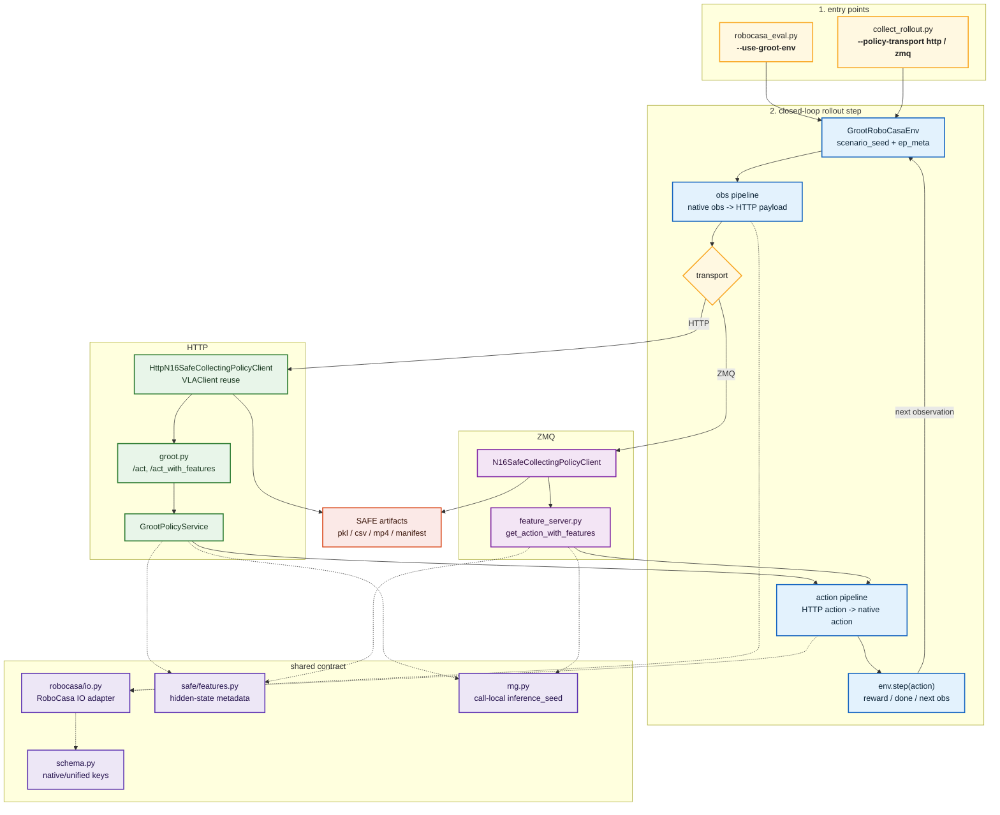

# GR00T N1.6 RoboCasa — Refactor Report

이 문서는 GR00T N1.6 RoboCasa HTTP/ZMQ 통합 작업에서 정리한 코드 구조, 책임 분리, 검증 범위를 요약한다. 실행 runbook과 상세 실험 수치는 `docs/groot/` 문서를 기준으로 하고, 이 문서는 리팩토링 결과와 현재 아키텍처를 빠르게 확인하는 용도다.

관련 문서:

- [docs/groot/README.md](README.md)
- [docs/groot/n16_04_safe_collection.md](n16_04_safe_collection.md)
- [docs/groot/n16_09_safe_parity.md](n16_09_safe_parity.md)
- [docs/groot/n16_10_safe_report.md](n16_10_safe_report.md)
- [docs/groot/n16_11_http_act_changes.md](n16_11_http_act_changes.md)

## 요약

리팩토링의 핵심은 GR00T `GrootRoboCasaEnv` native key와 프로젝트 공통 HTTP schema 사이의 변환 책임을 명확히 분리한 것이다.

- Generic RoboCasa processor는 그대로 generic robosuite RoboCasa env용으로 남긴다.
- GR00T RoboCasa 전용 변환은 `src.policies.groot.robocasa.io`를 단일 출처로 둔다.
- GR00T native rollout wrapper는 `src.policies.groot.robocasa.env_wrappers`로 공유해 ZMQ eval과 SAFE collection의 3-view video contract를 같이 유지한다.
- `src.processor`에는 GR00T 전용 processor를 추가해 기존 eval/collection 코드가 같은 `(obs_pipeline, action_pipeline)` 형태를 사용할 수 있게 했다.
- SAFE collection의 transport 차이는 client adapter에 가두고, pkl schema와 feature metadata는 HTTP/ZMQ가 같은 의미를 갖도록 맞췄다.
- HTTP `/act`, HTTP `/act_with_features`, ZMQ `get_action_with_features`는 같은 checkpoint/profile, 같은 schema, 같은 optional `inference_seed` 의미를 공유한다.

## 현재 구조



다이어그램에 나온 주요 파일의 역할은 아래처럼 읽으면 된다.

| 구간 | 파일 | 역할 | 책임 |
|---|---|---|---|
| Entry | [scripts/eval/robocasa_eval.py](../../scripts/eval/robocasa_eval.py) | HTTP eval 진입점 | `--use-groot-env`에서 GR00T 전용 env/processor 경로 선택 |
| Entry | [scripts/safe/groot_n16/robocasa/collect/collect_rollout.py](../../scripts/safe/groot_n16/robocasa/collect/collect_rollout.py) | SAFE collection 진입점 | HTTP/ZMQ transport 선택, episode 단위 수집 조율 |
| Local loop | [scripts/eval/groot_robocasa_zmq_eval.py](../../scripts/eval/groot_robocasa_zmq_eval.py) | ZMQ eval 진입점 | upstream rollout helper를 유지하면서 `src/policies/groot/robocasa/io.py` 관측 adapter와 shared env wrapper 사용 |
| Local loop | [scripts/safe/groot_n16/robocasa/collect/collect_env.py](../../scripts/safe/groot_n16/robocasa/collect/collect_env.py) | env 실행 | `GrootRoboCasaEnv`, shared wrapper stack, `scenario_seed`, `ep_meta`, `env.step()` 관리 |
| Local loop | [src/processor/factory.py](../../src/processor/factory.py) | processor 생성 | `make_groot_robocasa_processors()`로 obs/action pipeline 제공 |
| Local loop | [src/processor/obs/groot_robocasa.py](../../src/processor/obs/groot_robocasa.py) | obs 변환 | native observation을 HTTP payload 형태로 변환 |
| Local loop | [src/processor/action/groot_robocasa.py](../../src/processor/action/groot_robocasa.py) | action 변환 | HTTP action sub-key를 native GR00T action dict로 변환 |
| Transport | [scripts/safe/groot_n16/robocasa/collect/collect_policy_clients.py](../../scripts/safe/groot_n16/robocasa/collect/collect_policy_clients.py) | HTTP/ZMQ client adapter | transport별 요청, action 수신, SAFE record 누적 |
| HTTP | [scripts/utils/vla_client.py](../../scripts/utils/vla_client.py) | HTTP client base | `/act`, `/act_with_features`, `inference_seed` request 구성 |
| HTTP | [scripts/serve/groot.py](../../scripts/serve/groot.py), [src/policies/groot/core/service.py](../../src/policies/groot/core/service.py) | HTTP serving | FastAPI endpoint, GR00T policy load, action/feature response 생성 |
| ZMQ | [scripts/safe/groot_n16/robocasa/serve/feature_server.py](../../scripts/safe/groot_n16/robocasa/serve/feature_server.py) | ZMQ serving | `get_action_with_features` endpoint와 upstream `PolicyServer` 호환 |
| Shared contract | [src/policies/groot/robocasa/io.py](../../src/policies/groot/robocasa/io.py), [src/policies/groot/core/schema.py](../../src/policies/groot/core/schema.py) | key contract | native key와 unified key 변환의 단일 출처 |
| Shared contract | [src/policies/groot/robocasa/env_wrappers.py](../../src/policies/groot/robocasa/env_wrappers.py) | rollout wrapper | res256 3-view video recording filter와 upstream `MultiStepWrapper` 적용 |
| Shared contract | [src/policies/groot/safe/features.py](../../src/policies/groot/safe/features.py), [src/policies/groot/core/rng.py](../../src/policies/groot/core/rng.py) | feature/RNG contract | hidden-state metadata와 call-local inference RNG 의미 통일 |
| Output | [scripts/safe/groot_n16/robocasa/collect/collect_artifacts.py](../../scripts/safe/groot_n16/robocasa/collect/collect_artifacts.py) | artifact 저장 | SAFE pkl/csv/mp4/manifest 저장 |

## 주요 정리 내용

### 1. Generic RoboCasa와 GR00T RoboCasa 분리

`src/processor/obs/robocasa.py`와 `src/processor/action/robocasa.py`는 generic robosuite RoboCasa env용이다. 반면 GR00T `GrootRoboCasaEnv`는 observation/action key가 다르기 때문에 같은 processor를 억지로 공유하지 않는다.

대신 GR00T 전용 processor를 추가했다.

- `GrootRoboCasaObsProcessor`: native obs -> HTTP observation payload
- `GrootRoboCasaActionProcessor`: HTTP action sub-key -> native action dict
- `make_groot_robocasa_processors()`: 기존 processor factory와 같은 형태로 GR00T pipeline 제공

이 구조 덕분에 eval/collection 호출부는 processor shape를 공유하고, 실제 key 변환 구현은 `src/policies/groot/robocasa/io.py`에 모인다.

### 2. `src/policies/groot/robocasa/io.py`를 단일 IO adapter로 고정

이전 구조의 가장 큰 냄새는 SAFE collection 쪽 helper가 `src/policies/groot/robocasa/io.py`와 비슷한 변환을 다시 정의한다는 점이었다. 현재는 중복 변환을 제거하고, `collect_schema.py`는 SAFE pkl 저장에 필요한 helper만 갖는다.

`src/policies/groot/robocasa/io.py`가 담당하는 것:

- observation alias 정리와 required key 검증
- image/state/instruction을 HTTP request 형태로 변환
- HTTP action dict를 GR00T native action chunk 또는 single step으로 변환
- action prefix 정규화와 shape 처리

`collect_schema.py`가 담당하는 것:

- SAFE csv/pkl용 7D action vector 추출
- GR00T action vector 추출
- numpy/pickle 직렬화 helper

ZMQ eval client도 이 경계를 따른다. `scripts/eval/groot_robocasa_zmq_eval.py`는 더 이상 자체 `OBS_ALIASES`를 갖지 않고 `prepare_groot_robocasa_observation()`으로 policy payload를 만든다. 따라서 HTTP eval, SAFE HTTP, SAFE ZMQ, N1.6 ZMQ eval은 같은 native observation alias와 required-key 검증을 공유한다.

### 3. Native rollout wrapper 공유

`GrootRoboCasaEnv`는 3개 카메라를 `res256`과 `res512` 두 해상도로 함께 노출할 수 있다. upstream `VideoRecordingWrapper`는 observation key에 `"video"`가 들어간 항목을 모두 이어 붙이므로, 별도 필터가 없으면 저장 영상이 3-view가 아니라 6-view가 된다.

이 wrapper 책임은 transport와 무관하므로 `src.policies.groot.robocasa.env_wrappers`로 분리했다.

- `CanonicalRoboCasaVideoObservationFilter`: video recorder가 볼 observation을 `video.res256_image_side_0/1/wrist_0` 세 개로 제한
- `wrap_groot_robocasa_eval_env()`: upstream `VideoRecordingWrapper`와 `MultiStepWrapper` 적용

이 helper는 N1.6 ZMQ eval과 SAFE collection이 같이 사용한다. HTTP path의 payload/action 변환은 이미 `make_groot_robocasa_processors()` -> `src/policies/groot/robocasa/io.py`를 타므로, HTTP eval이 upstream video/multistep wrapper를 직접 쓰는 경우에만 이 env wrapper를 같이 쓰면 된다.

### 4. HTTP client는 기존 `VLAClient`를 상속

HTTP SAFE collection client는 [scripts/utils/vla_client.py](../../scripts/utils/vla_client.py)의 `VLAClient`를 상속한다. 따라서 HTTP request 구성, `/act_with_features` 호출, `inference_seed` 전달은 기존 HTTP client contract를 재사용한다.

ZMQ client는 upstream GR00T `PolicyServer` request/response 형식을 유지해야 하므로 별도 transport adapter로 남긴다. 다만 SAFE record 저장, metadata 갱신, call-local seed schedule은 HTTP/ZMQ client가 같은 mixin과 규칙을 쓴다.

### 5. HTTP/ZMQ feature extraction contract 통일

HTTP `/act_with_features`와 ZMQ `get_action_with_features`는 같은 `SafeFeatureExtractor` 계열 로직을 사용한다. 기본 feature scope는 embodiment decoded horizon 기준의 valid action-token slice이며, RoboCasa N1.6 PandaOmron에서는 기본 `H=16`이다.

`--feature-action-horizon`을 쓰면 ah8/ah16 같은 action-horizon ablation을 같은 축 의미로 수집할 수 있다. 이때 server export horizon과 collector `--n_action_steps`가 맞지 않으면 collection 검증 단계에서 실패하는 것이 정상이다.

### 6. Inference seed 의미 통일

HTTP와 ZMQ 모두 optional call-local `inference_seed`를 지원한다.

- HTTP: request payload의 `inference_seed`
- ZMQ: request `options["inference_seed"]`
- Collector schedule: `base_inference_seed + policy_call_index`

`temporary_inference_seed()`는 CPU/GPU/NumPy RNG state를 추론 호출 동안만 고정하고, 호출 후 이전 state로 복원한다. 이는 per-call action parity를 보기 위한 장치이지, closed-loop trajectory identity를 보장하는 장치는 아니다.

## 실행 경로

### HTTP `/act`

```text
robocasa_eval.py --use-groot-env
  -> make_groot_robocasa_processors()
  -> VLAClient.predict()
  -> scripts/serve/groot.py /act
  -> GrootPolicyService
  -> GrootRoboCasaActionProcessor
  -> env.step()
```

### HTTP `/act_with_features`

```text
collect_rollout.py --policy-transport http
  -> HttpN16SafeCollectingPolicyClient
  -> VLAClient.predict_with_features()
  -> scripts/serve/groot.py /act_with_features
  -> GrootPolicyService + SafeFeatureExtractor
  -> SAFE record + env.step()
```

### ZMQ `get_action_with_features`

```text
collect_rollout.py --policy-transport zmq
  -> N16SafeCollectingPolicyClient
  -> feature_server.py get_action_with_features
  -> SafeN16FeaturePolicy + SafeFeatureExtractor
  -> SAFE record + env.step()
```

## 해결한 문제

### Processor contract 불일치

문제는 generic RoboCasa processor와 GR00T `GrootRoboCasaEnv` adapter가 서로 다른 책임을 갖는데도 호출부에서 같은 모양으로 다루기 어려웠다는 점이었다. GR00T 전용 processor와 `make_groot_robocasa_processors()`를 추가해 호출부의 shape를 통일했다.

효과:

- `robocasa_eval.py --use-groot-env`와 SAFE collection이 같은 processor factory 패턴을 쓴다.
- native key 변환은 `src/policies/groot/robocasa/io.py`로 모인다.
- generic RoboCasa pipeline과 GR00T native pipeline의 경계가 문서와 코드에서 모두 드러난다.

### `collect_schema.py`와 `src/policies/groot/robocasa/io.py`의 중복

문제는 SAFE pkl 저장 helper가 IO adapter 역할까지 일부 반복하던 점이었다. 현재는 `collect_schema.py`가 `src/policies/groot/robocasa/io.py`의 key/action helper를 import하고, SAFE pkl 고유 로직만 유지한다.

효과:

- observation/action 변환의 단일 출처가 생겼다.
- SAFE pkl schema 변경과 HTTP/ZMQ IO 변경이 섞이지 않는다.
- transport별 collector가 같은 action vector 추출 규칙을 쓴다.

### Action key mismatch 회귀 위험

GR00T native action의 `end_effector_rotation`, `gripper_close`는 project HTTP schema에서 각각 `action.eef_axisangle`, `action.gripper`에 매핑된다. 이 매핑이 흔들리면 회전과 그리퍼 action이 누락될 수 있다.

현재 contract:

```text
end_effector_position -> action.eef_pos
end_effector_rotation -> action.eef_axisangle
gripper_close         -> action.gripper
```

해당 contract는 `schema.py`, `src/policies/groot/robocasa/io.py`, processor tests, serve tests에서 같이 검증한다.

### Scenario replay와 inference seed 혼동

`scenario_seed`와 `ep_meta`는 RoboCasa scenario/layout/style/config replay에 대한 장치다. `inference_seed`는 model inference RNG에 대한 장치다. 둘은 목적이 다르며, 둘을 같이 고정해도 closed-loop trajectory가 bitwise identical하다고 주장할 수는 없다.

현재 문서와 검증에서는 다음처럼 분리한다.

- same observation action parity: HTTP/ZMQ action value가 같은지 확인
- transport smoke: 같은 seed schedule과 `ep_meta`에서 success/failure 결과가 정렬되는지 확인
- trajectory identity: reset-time full sim state replay가 있어야 주장 가능

## 검증 상태

최근 정리된 검증 범위는 아래와 같다. 상세 수치와 artifact path는 [n16_09_safe_parity.md](n16_09_safe_parity.md)와 [n16_10_safe_report.md](n16_10_safe_report.md)를 기준으로 한다.

| 검증 | 상태 | 비고 |
|---|---|---|
| HTTP `/act` same-observation parity | 통과 | HTTP repeat 및 HTTP/ZMQ action 비교에서 `max_abs=0` |
| HTTP `/act_with_features` SAFE pkl smoke | 통과 | pkl schema, hidden-state metadata, loader 호환성 확인 |
| ZMQ/HTTP closed-loop transport smoke | 통과 | `CloseFridge_PandaOmron_Env`, seeds `100000..100009`, HTTP/ZMQ 모두 `8/10` success |
| Success/failure set alignment | 통과 | smoke 범위에서 실패 seed set 동일 |
| Step-count/action trace identity | 부분 검증 | smoke에서 대부분 정렬됐지만, trajectory identity claim은 하지 않음 |
| Focused unit tests | 통과 | processor, serve, SAFE collect, feature server 계열 테스트 통과 |
| `git diff --check` | 통과 | 문서/코드 whitespace check 통과 |

검증 해석:

- 현재 결과는 HTTP/ZMQ transport가 같은 observation/action/schema/feature contract를 공유한다는 근거다.
- full benchmark HTTP SR을 ZMQ official baseline과 같은 수준으로 확정한 결과는 아직 아니다.
- closed-loop trajectory가 완전히 같다는 주장도 아직 아니다.

## 남은 항목

1. Full task-set HTTP benchmark SR 측정
2. Inference-step-level failure onset/intervention label protocol 정의
3. Reset-time full sim state replay 기반 trace identity 검증
4. `--feature-slice all` (`H=50`)과 valid horizon (`H=16`) feature ablation
5. Detector robustness sanity check: 새 rollout seed set, random-label sanity, task-only/length-only baseline
6. Taskwise score-trajectory plot 정리

## 운영 기준

이후 GR00T RoboCasa checkpoint나 profile을 추가할 때는 아래 파일을 같이 확인한다.

- [configs/checkpoints/groot__robocasa365_ckpt120000.yaml](../../configs/checkpoints/groot__robocasa365_ckpt120000.yaml)
- [src/policies/groot/core/schema.py](../../src/policies/groot/core/schema.py)
- [src/policies/groot/robocasa/io.py](../../src/policies/groot/robocasa/io.py)
- [src/processor/factory.py](../../src/processor/factory.py)
- [scripts/utils/vla_client.py](../../scripts/utils/vla_client.py)
- [scripts/safe/groot_n16/robocasa/collect/collect_policy_clients.py](../../scripts/safe/groot_n16/robocasa/collect/collect_policy_clients.py)
- [docs/groot/n16_09_safe_parity.md](n16_09_safe_parity.md)
- [docs/groot/n16_11_http_act_changes.md](n16_11_http_act_changes.md)

판단 기준은 간단하다. Generic RoboCasa env는 generic processor를 쓰고, GR00T `GrootRoboCasaEnv`는 GR00T 전용 processor를 쓴다. 둘의 공통점은 processor pipeline shape이고, key 변환의 단일 출처는 `src.policies.groot.robocasa.io`다.
